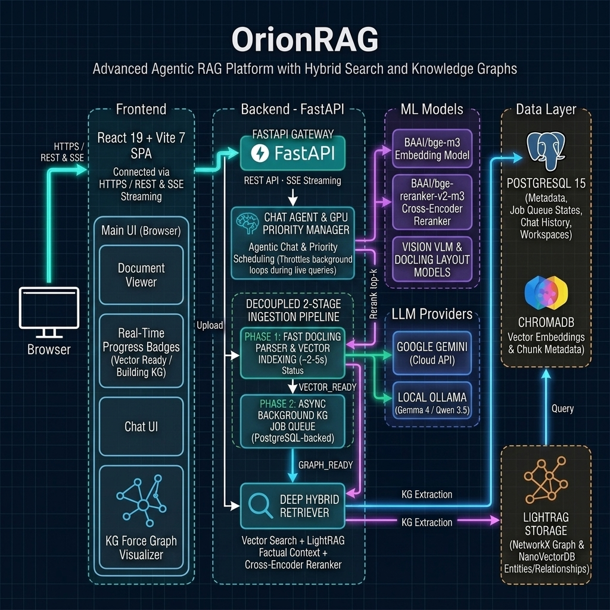

<div align="center">

# OrionRAG

### Hybrid Knowledge Base with Agentic Chat, Citations & Knowledge Graph

[](https://python.org)
[](https://react.dev)
[](https://fastapi.tiangolo.com)
[](https://docker.com)
[](LICENSE)

**Upload documents. Ask questions. Get cited answers.**

Orion is a production-grade, hybrid RAG pipeline that combines vector similarity search, hierarchical knowledge graphs, and cross-encoder reranking into a single, high-fidelity retrieval system. Powered by Google Gemini (cloud) or local Ollama (fully offline), it offers page-level document navigation, image/table extraction, and compliance-level citations.

[Features](#features) · [Quick Start](#quick-start) · [Model Recommendations](#model-recommendations) · [Configuration](#configuration) · [MCP Server](#mcp-server)

</div>

---

## Architecture

<div align="center">



</div>

### Decoupled 2-Stage Ingestion Machine
Orion decouples fast vector search from background Knowledge Graph construction:
1. **Phase 1 (Vector Indexing ~2–5s)**: PDF parsing, chunking, and vector embedding write to ChromaDB. Document instantly becomes searchable (`VECTOR_READY`).
2. **Phase 2 (Async Background KG Queue)**: A background worker sequentially processes pending documents using LightRAG entity/relationship extraction, transitioning documents to `GRAPH_READY` (or `GRAPH_FAILED`) without blocking queries.
3. **GPU Priority Management**: During active user streaming/chat sessions, background KG extraction automatically yields execution to ensure low-latency user generation.

---

## Core Capabilities

*   **Deep Document Parsing (Docling / Marker)**: Parses headings, margins, page boundaries, and tables. Restructures PDF, DOCX, and PPTX files into layout-aware Markdown chunks with structural hierarchy.
*   **Decoupled Async Knowledge Graph**: Documents are searchable via vector search in 2-5 seconds while LightRAG processes entity graphs in a background PostgreSQL queue with automatic mid-flight cleanup and GPU priority throttling.
*   **Parallel Hybrid Retrieval**: Integrates three retrieval paths: vector search over-fetching (top-20 candidates), LightRAG entity/relationship extraction, and real-time graph traversal.
*   **Cross-Encoder Reranking**: Re-evaluates retrieval candidates using a joint-scoring Cross-Encoder model (`BAAI/bge-reranker-v2-m3`) for high-precision context filtering.
*   **Visual Document Intelligence**: Extracts inline images and tables, automatically captions them using a Vision LLM, and embeds those summaries directly into the chunk vectors to make visual media semantically searchable.
*   **Grounded Citations**: Citations are represented by persistent 4-character inline badges mapping back to original source filenames, exact page numbers, and structural heading paths in the PDF viewer.
*   **Interactive Knowledge Graph**: Generates an interactive 2D force-directed canvas visualizing extracted entities and relationships with real-time dragging, panning, zooming, and physics simulation.
*   **Multi-Provider LLM & Thinking**: Support for cloud-based Gemini (2.5-flash, 3.1-flash-lite) and local Ollama (Gemma 4, Qwen 3.5) with native tool calling and extended reasoning panels.

---

## Model Recommendations

| Provider | Model | Setup | Recommendation / Role |
| :--- | :--- | :--- | :--- |
| **Gemini** | `gemini-3.1-flash-lite` | Cloud API | **Recommended default** — high speed, cost-effective, supports level-based thinking |
| **Ollama** | `gemma4:e4B` | Local | Best with text and image inputs **Recommended Model** for localy running|
| **Ollama** | `qwen3.5:9b` or `qwen3.5:4b` | Local | Native tool-calling support, fast responses on standard developer machines |
| **Ollama** | `gemma3:12b` | Local | Robust reasoning, requires prompt-based tool calling fallback |

### Document & Multimodal Processing Models

Orion utilizes specialized local models to parse, transcribe, and structure various document types and media files during ingestion:

| Pipeline Phase | Task | Model / Engine | Details & Configuration |
| :--- | :--- | :--- | :--- |
| **PDF/Word/PPT** | Layout & Table Extraction | **Docling** (with YOLOv8 + TableFormer) | Standard high-fidelity document layout extraction. Configure device via `ORION_DOCLING_DEVICE`. |
| **PDF Code & Math** | Mathematical Formulas | **CodeFormulaV2** (`docling-project/CodeFormulaV2`) | Auto-inline VLM loaded locally via the Transformers engine for LaTeX and formula representation. |
| **OCR (Fallback)** | Text Recognition | **RapidOCR** (with ONNX Runtime) | Lightweight local OCR for image and table scanning inside Docling. |
| **Audio/Video** | Voice Transcription | **faster-whisper** (`base` model) | CTranslate2-optimized Whisper engine. CPU uses `int8` quantization; GPU uses `float16`. Runs 4x-8x faster than standard Whisper. |
| **Video Keyframes** | Image OCR | **EasyOCR** (local) | High-speed local text recognition for captured video frames. |
| **KG & Vectors** | Text Embeddings | **BAAI/bge-m3** (Sentence-Transformers) | Multi-lingual, 1024-dimension embedding model. Configure via `ORION_EMBEDDING_DEVICE`. |
| **Reranking** | Context Reranking | **BAAI/bge-reranker-v2-m3** (Cross-Encoder) | Re-scores retrieval candidates for top-precision prompt context. Configure via `ORION_RERANKER_DEVICE`. |

---


## Quick Start

### Option A: Docker (Full Stack)

```bash
git clone https://github.com/VedAditya-10/OrionRAG.git OrionRAG
cd OrionRAG
cp .env.example .env
# Edit .env and set your model configurations / keys
docker compose up -d
```
*Access the React UI at `http://localhost:5174`.*

### Option B: Local Development

#### 1. Start Postgres & ChromaDB:
```bash
docker compose up postgres chromadb -d
```

#### 2. Run Backend (Python 3.11):
```bash
cd backend
python -m venv venv
# Windows: .\venv\Scripts\activate; Linux/macOS: source venv/bin/activate
pip install -r requirements.txt
# (Optional) For GPU Acceleration on Windows:
# pip install torch torchvision --index-url https://download.pytorch.org/whl/cu124 --force-reinstall
uvicorn app.main:app --port 8080 --reload
```

#### 3. Run Frontend (React/Vite):
```bash
cd frontend
npm install
npm run dev
```

---

## Configuration

Set these keys in your `.env` file to customize hardware allocation and pipeline behavior:

| Variable | Default | Description |
| :--- | :--- | :--- |
| `ORION_DOCUMENT_PARSER` | `docling` | Document parser provider: `docling` or `marker` |
| `ORION_EMBEDDING_DEVICE` | `cuda` | Hardware device for embedding (`cuda` or `cpu`) |
| `ORION_RERANKER_DEVICE` | `cpu` | Hardware device for reranking (`cpu` or `cuda`) |
| `ORION_DOCLING_DEVICE` | `cpu` | Hardware device for Docling parsing (`cpu` or `cuda`) |
| `ORION_EMBEDDING_MODEL` | `BAAI/bge-m3` | Embedding model for semantic search (1024-dim) |
| `ORION_RERANKER_MODEL` | `BAAI/bge-reranker-v2-m3` | Cross-encoder model for reranking |
| `ORION_KG_LANGUAGE` | `English` | Extraction language for the LightRAG knowledge graph |
| `ORION_ENABLE_KG` | `true` | Enable/disable Knowledge Graph extraction during ingestion |
| `OLLAMA_NUM_CTX` | `8192` | Context window size (in tokens) for Ollama inference |

---

## MCP Server

Orion includes a Model Context Protocol (MCP) server (`mcp-server/`) that exposes its core retrieval functions to external AI IDEs and desktop tools:
*   `get_workspace_list`: Retrieves a list of all active knowledge bases.
*   `query`: Runs hybrid search (Vector + LightRAG + Reranker) for a given `workspace_id`.
*   `get_document_by_id`: Fetches Markdown text and processing status for an indexed document.
*   `get_chunks`: Retrieves raw parsed text chunks for a specific document.

### How to Run the MCP Server

#### Option 1: Standalone Node.js
```bash
cd mcp-server
npm install
npm run build

# Start HTTP SSE Server on port 8001
TRANSPORT=http PORT=8001 npm start
```

#### Option 2: Docker
```bash
docker compose up mcp-server -d
```

### Integration with AI Tools

#### **Cursor IDE**
1. Open **Cursor Settings** → **Models** → **MCP**.
2. Click **+ Add New MCP Server**.
3. Set **Type** to `SSE` (or `Streamable HTTP`) and **URL** to:
   ```text
   http://localhost:8001/mcp
   ```

#### **Claude Desktop**
Add Orion's MCP server to your `claude_desktop_config.json`:
```json
{
  "mcpServers": {
    "orionrag": {
      "url": "http://localhost:8001/mcp"
    }
  }
}
```

---

⭐ If you find OrionRAG useful, please consider giving it a **star** to support its continued development!
